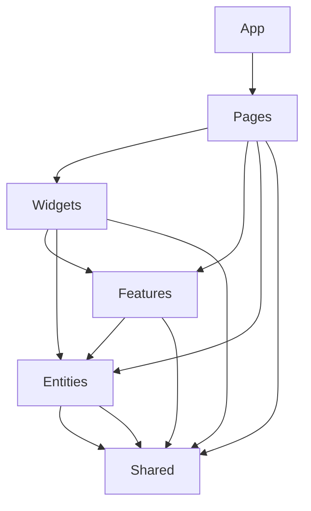

# 15. Documentation & Handoff

A well-documented codebase is essential for maintainability, onboarding, and long-term success. This guide establishes documentation standards that align with industry best practices from React, Vite, FSD, and modern component libraries.

## Documentation Structure

### Required Documentation Files

```
docs/
├── README.md                    # Project overview & quick start
├── CONTRIBUTING.md              # Development workflow & guidelines
├── DEPLOYMENT.md                # Build & deployment instructions
├── API.md                       # API integration patterns
├── TESTING.md                   # Testing strategy & examples
├── ARCHITECTURE.md              # FSD structure & conventions
└── components/                  # Component documentation
    ├── README.md                # Component library overview
    └── [component-name].md      # Individual component docs
```

## 1. Project README Structure

Follow the proven React.dev documentation pattern:

```markdown
# Project Name

Brief description of what the application does and its primary purpose.

## Quick Start

```bash
# Clone and install
git clone [repository-url]
cd [project-name]
pnpm install

# Start development server
pnpm dev
```

## Project Structure

Brief overview of FSD architecture:
- `app/` - Application setup and providers
- `pages/` - Route compositions
- `widgets/` - Complex UI blocks
- `features/` - User interactions
- `entities/` - Business domain models
- `shared/` - Reusable utilities and UI components

## Available Scripts

- `pnpm dev` - Start development server
- `pnpm build` - Production build
- `pnpm preview` - Preview production build locally
- `pnpm test` - Run unit tests
- `pnpm test:e2e` - Run E2E tests
- `pnpm lint` - Run ESLint
- `pnpm type-check` - Run TypeScript compiler

## Technology Stack

- **Framework:** React 18 + Vite
- **Language:** TypeScript (strict mode)
- **Architecture:** Feature-Sliced Design
- **Routing:** TanStack Router
- **Server State:** TanStack Query v5
- **Client State:** Zustand
- **UI:** shadcn/ui + Tailwind CSS
- **Forms:** React Hook Form + Zod
- **Testing:** Vitest + RTL + Playwright
```

## 2. Component Documentation Standards

Based on shadcn/ui's MDX documentation pattern, create component docs using this structure:

```markdown
# ComponentName

Brief description of the component's purpose and when to use it.

## Installation

```bash
npx shadcn-ui@latest add [component-name]
```

## Usage

```tsx
import { ComponentName } from '@/shared/ui/component-name'

export function Example() {
  return (
    <ComponentName
      prop1="value"
      prop2={true}
    >
      Content
    </ComponentName>
  )
}
```

## Examples

### Basic Usage
[Code example with explanation]

### With Form Integration
[Example showing React Hook Form integration]

### Advanced Usage
[Complex composition examples]

## API Reference

| Prop | Type | Default | Description |
|------|------|---------|-------------|
| prop1 | string | - | Description of prop1 |
| prop2 | boolean | false | Description of prop2 |

## Accessibility

- Keyboard navigation patterns
- ARIA attributes used
- Screen reader considerations

## Composition

Shows how this component works with other components in your design system.
```

## 3. API Integration Documentation

Document server state management following TanStack Query patterns:

```markdown
# API Integration Patterns

## Query Patterns

### Basic Data Fetching
```tsx
// entities/user/api/queries.ts
export const userQueries = {
  all: () => ['users'] as const,
  lists: () => [...userQueries.all(), 'list'] as const,
  list: (filters: UserFilters) => [...userQueries.lists(), filters] as const,
  details: () => [...userQueries.all(), 'detail'] as const,
  detail: (id: string) => [...userQueries.details(), id] as const,
}

export function useUsers(filters: UserFilters) {
  return useQuery({
    queryKey: userQueries.list(filters),
    queryFn: () => api.users.getList(filters),
  })
}
```

### Mutation Patterns
```tsx
// features/user-profile/api/mutations.ts
export function useUpdateUser() {
  const queryClient = useQueryClient()
  
  return useMutation({
    mutationFn: api.users.update,
    onSuccess: (updatedUser) => {
      // Update cached user data
      queryClient.setQueryData(
        userQueries.detail(updatedUser.id),
        updatedUser
      )
      
      // Invalidate user lists to refetch
      queryClient.invalidateQueries({
        queryKey: userQueries.lists()
      })
    },
    onError: (error) => {
      toast.error('Failed to update user')
    }
  })
}
```

### Optimistic Updates
[Example of optimistic update pattern]

### Error Handling
[Standardized error handling patterns]
```

## 4. Testing Documentation

Based on Playwright and Vitest best practices:

```markdown
# Testing Strategy

## Testing Pyramid

### Unit Tests (Vitest + RTL)
- **Location:** Co-located with source files (`.test.tsx`)
- **Focus:** Component behavior from user perspective
- **Tools:** `@testing-library/react`, `@testing-library/user-event`

```tsx
// shared/ui/button/button.test.tsx
import { render, screen } from '@testing-library/react'
import { Button } from './button'

describe('Button', () => {
  it('renders with correct text', () => {
    render(<Button>Click me</Button>)
    expect(screen.getByRole('button', { name: 'Click me' })).toBeInTheDocument()
  })
})
```

### E2E Tests (Playwright)
- **Location:** `/e2e` directory
- **Focus:** Critical user flows
- **Naming:** `[feature].spec.ts`

```tsx
// e2e/auth.spec.ts
import { test, expect } from '@playwright/test'

test('user can sign in and access dashboard', async ({ page }) => {
  await page.goto('/login')
  await page.fill('[data-testid="email"]', 'user@example.com')
  await page.fill('[data-testid="password"]', 'password')
  await page.click('[data-testid="submit"]')
  
  await expect(page).toHaveURL('/dashboard')
  await expect(page.getByRole('heading', { name: 'Dashboard' })).toBeVisible()
})
```

### Visual Regression Tests
```tsx
test('button component visual', async ({ page }) => {
  await page.goto('/storybook/button')
  await expect(page.locator('[data-testid="button-default"]')).toHaveScreenshot()
})
```

## Test Configuration

Document test configuration patterns and shared utilities.
```

## 5. FSD Architecture Documentation

Document Feature-Sliced Design conventions:

```markdown
# Architecture Guide

## Layer Dependencies



## Public API Standards

Every slice must export its public interface through `index.ts`:

```tsx
// entities/user/index.ts
export { UserCard } from './ui/user-card'
export { useUser, useUsers } from './api/queries'
export { userModel } from './model/store'
export type { User, UserFilters } from './model/types'
```

## Cross-Layer Import Rules

### ✅ Allowed
```tsx
// features/user-profile can import from entities/user
import { User, useUser } from '@/entities/user'
```

### ❌ Forbidden
```tsx
// entities/user CANNOT import from features/user-profile
import { UpdateUserForm } from '@/features/user-profile' // ❌
```

## Naming Conventions

- **Features:** Verb + noun (e.g., `add-to-cart`, `update-profile`)
- **Entities:** Business domain nouns (e.g., `user`, `product`, `order`)
- **Widgets:** UI-focused names (e.g., `header`, `sidebar`, `product-grid`)
```

## 6. Development Workflow Documentation

Create a comprehensive contributing guide:

```markdown
# Contributing Guide

## Development Setup

1. **Prerequisites:**
   - Node.js 22+
   - pnpm 8+

2. **Installation:**
   ```bash
   git clone [repo]
   cd [project]
   pnpm install
   ```

3. **Environment Configuration:**
   ```bash
   cp .env.example .env.local
   # Edit .env.local with your values
   ```

## Development Workflow

### Branch Strategy
- `main` - Production-ready code
- `develop` - Integration branch
- `feature/[name]` - Feature development
- `fix/[name]` - Bug fixes

### Code Quality Checks
Before committing, ensure:
```bash
pnpm lint        # ESLint checks
pnpm type-check  # TypeScript validation
pnpm test        # Unit tests pass
pnpm build       # Production build works
```

### Commit Convention
Follow conventional commits:
- `feat:` - New features
- `fix:` - Bug fixes
- `docs:` - Documentation changes
- `refactor:` - Code refactoring
- `test:` - Test additions/changes

### Pull Request Process
1. Create feature branch from `develop`
2. Implement changes following FSD architecture
3. Add tests for new functionality
4. Update documentation if needed
5. Submit PR with clear description
6. Ensure CI checks pass
```

## 7. Deployment Documentation

```markdown
# Deployment Guide

## Build Process

### Production Build
```bash
pnpm build
```

Output: `dist/` directory containing:
- `index.html` - Entry point
- `assets/` - Bundled JS/CSS/images
- Static assets

### Docker Deployment

```dockerfile
# Multi-stage build
FROM node:22-alpine AS builder
WORKDIR /app
COPY package*.json ./
RUN pnpm install
COPY . .
RUN pnpm build

FROM nginx:alpine
COPY --from=builder /app/dist /usr/share/nginx/html
COPY nginx.conf /etc/nginx/nginx.conf
EXPOSE 80
```

### Environment Configuration
- `VITE_API_URL` - Backend API endpoint
- `VITE_APP_TITLE` - Application title
- Additional environment variables as needed

### Health Checks
Implement health check endpoint for Kubernetes deployments.
```

---

**Documentation Checklist:**

- [ ] Project README with quick start guide
- [ ] Component documentation for all shared/ui components  
- [ ] API integration patterns documented
- [ ] Testing examples and conventions
- [ ] FSD architecture guide with examples
- [ ] Contributing guide with workflow
- [ ] Deployment instructions with Docker
- [ ] Environment configuration guide
- [ ] Code review guidelines
- [ ] Troubleshooting common issues

**Project Setup Complete!** Your React application now has comprehensive documentation following industry best practices from React, Vite, FSD, and modern component libraries.